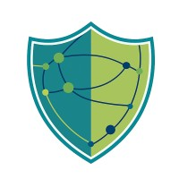

<p align="center">
    
</p>
<h1 align="center">Recitals Anonymization Manager</h1>
<p align="center">
    Privacy-preserving data anonymization toolkit for research and analysis
</p>

## 🛡️ Overview
RECITALS Anonymization Manager is a privacy-preserving data anonymization toolkit that supports key techniques such as k-anonymity, l-diversity and t-closeness. It enables users to protect sensitive information in datasets while maintaining data utility.

The toolkit is designed to simplify the anonymization process by providing reusable templates, allowing users to easily apply privacy transformations without manually configuring complex rules. This makes it suitable for researchers and developers who need fast, consistent, and reliable data anonymization workflows.
## Supported Techniques
- **k-anonymity**: Ensures that each record is indistinguishable from at least *k-1* other records with repsect to identifying/quasi-identifying attributes, reducing the risk of re-identification.
- **l-diversity**: Extends k-anonymity by ensuring that sensitive attributes within each group have at least *l* well-represented values.
- **t-closeness**: Strengthens privacy further by requiring that the distribution of sensitive attributes in each group is within a threshold *t* of the overall dataset distribution.

## ⚙️ Dependencies
The **Anonymization Manager** leverages two core libraries to anonymize data by applying privacy preserving techniques.

### Core Libraries
<table align="center">
<tr>
    <td align="center" width="50%">
    <a href="https://arx.deidentifier.org/">
    <br/>
    </a>
    <b>ARX Anonymization Tool</b>
    <p align="justify">
        ARX is a comprehensive open source software for anonymizing sensitive data.
    </p>
        <td align="center" width="50%">
    <a href="https://arx.deidentifier.org/">
    <br/>
    </a>
    <b>Anjana</b>
    <p align="justify">
        Anjana is an open source Python library for anonymizing sensitive data.
    </p>
</tr>
</table>

### Python Infrastructure
The manager leverages a modern Python stack for performance and reliability:
* **Pydantic**: Data validation and settings management.
* **Pandas**: High-performance data structures and analysis.
* **JPype**: Integration bridge between Python and the ARX Java backend.
* **Pytest**: Automated testing and quality assurance.

## 📩 Installation

1. Install [uv](https://docs.astral.sh/uv/) package/project manager

2. Install project's dependencies

    ```
    uv sync --all-extras --group dev
    ```
## 📚 Turoials
- to be filled

## 👥 Contributors
<div align=center>
<table>
    <tr>
        <td align="center" width="150">
        <a href="https://www.linkedin.com/in/dimitris-pavlou-gr">
        <br />
        <b>Dimitrios Pavlou</b> 
        </a><br/>
        <sub>Research Assistant</sub>
        </td>
        <td align="center" width="150">
        <a href="https://www.linkedin.com/in/kchousos">
        <br />
        <b>Konstantinos Chousos</b> 
        </a><br/>
        <sub>Research Assistant</sub>
        </td>
                <td align="center" width="150">
        <a href="https://www.linkedin.com/in/stamoulisgeorge">
        <br />
        <b>George Stamoulis</b> 
        </a><br/>
        <sub>Research Associate</sub>
        </td>
    </tr>
</table>
</div>

## 🇪🇺 Funding
This project has received funding from the European Union’s Horizon Europe research and innovation programme under grant agreement [**No.101168490**](https://cordis.europa.eu/project/id/101168490). The European Commision authority managing RECITALS project is the European Cybersecurity Competence Center. 
<div align="center">

</div>
